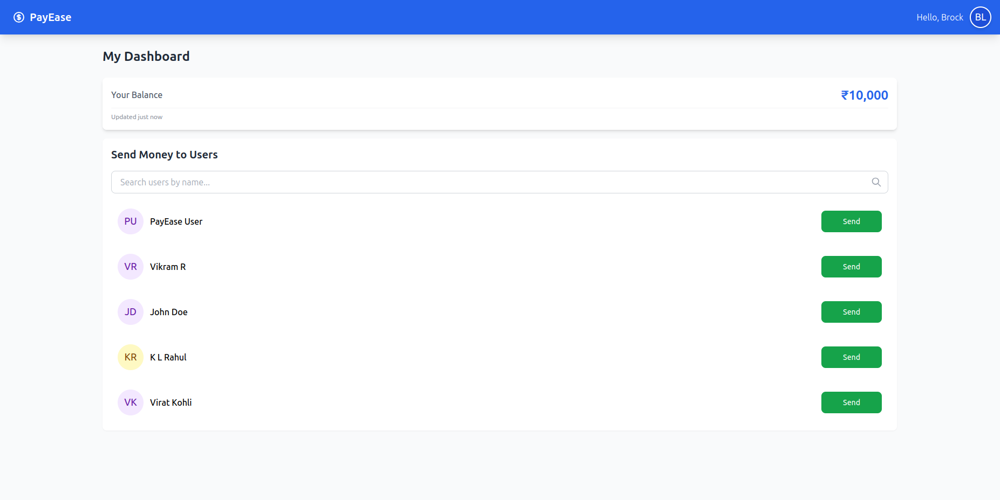

# PayEase: Simple Money Transfer Application

PayEase is a lightweight money transfer application that allows users to securely transfer funds between accounts.



## Tech Stack

### Frontend
- React.js
- Tailwind CSS
- React Router
- Axios

### Backend
- Node.js
- Express.js
- MongoDB
- JWT Authentication

## Features

- User registration and authentication
- Dashboard to view balance
- Simple money transfers between users
- User search functionality

## Setup Instructions

1. **Clone the repository**

```bash
git clone https://github.com/Vikram-0401/EasePay.git
cd EasePay
```

2. **Install backend dependencies**

```bash
cd backend
npm install
```

3. **Setup MongoDB**

```bash
# Option A: Using local MongoDB
sudo apt update
sudo apt install -y mongodb
sudo systemctl start mongodb

# OR

# Option B: Using Docker (Simple)
docker pull mongo
docker run -d -p 27017:27017 --name mongodb mongo
```

4. **Configure backend**

Create `backend/config.js`:

```javascript
module.exports = {
  JWT_SECRET: "your-secret-key"
}
```

5. **Start backend server**

```bash
node index.js
# The server will start on port 3000
```

6. **Install frontend dependencies**

```bash
cd ../frontend
npm install
```

7. **Start frontend development server**

```bash
npm run dev
# The frontend will be available at http://localhost:5173
```


